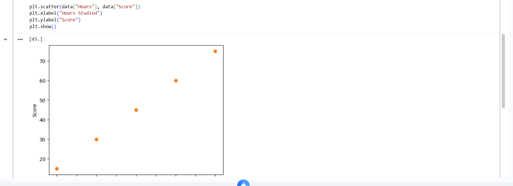

# Student Score Prediction

This project predicts student exam scores using Linear Regression based on study hours.

---

## 📌 Problem Statement
The goal is to build a machine learning model that estimates a student's score based on the number of hours they studied.

---

## ⚙️ Approach
- Used Linear Regression
- Created sample dataset
- Trained model using scikit-learn

---

## 📊 Visualization

---

## 🚀 Output
Predicted score for 6 hours: (45)
##project structure

---

## 🛠️ Tools Used
- Python
- Pandas
- Scikit-learn
- Matplotlib
